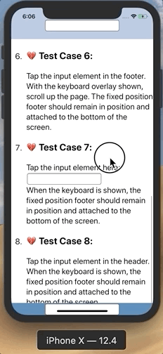
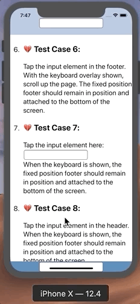

# patch for iOS 12 key board bug

## Detail

https://github.com/WebKit/webkit/commit/ec5ad1bd1bae03e0f85e4415e018ea5d09e046c1

```
2019-09-06  Darryl Pogue  <darryl@dpogue.ca>

        REGRESSION(iOS 12): Keyboard dismissal leaves WKWebView viewport-fit=cover content offscreen
        https://bugs.webkit.org/show_bug.cgi?id=192564

        Reviewed by Tim Horton.

        The new keyboard height was being read into a variable after the scrollview had already been
        adjusted. This worked when the keyboard was opening, because the scrollview is adjusted with
        the correct value a second time when the keyboard animation has finished. However, when the
        keyboard is closed, the adjustment was being made before the correct height was stored,
        leading to the scrollview being positioned as if the keyboard were still open.

        * UIProcess/ios/WKScrollView.mm:
        (-[WKScrollView _adjustForAutomaticKeyboardInfo:animated:lastAdjustment:]):
```

Before:



After add this patch:




## Build

```
npm install 
npm run build
```

## Usage

```
npm add fix-ios-12-keyboard-bug --save
import 'fix-ios-12-keyboard-bug';
```

or just copy `node_modules\@hz\fix-ios-12-keyboard-bug\dist\fix-ios-12-keyboard-bug.min.js` and add to your html file.

```
<script src='{{resDomain}}js/fix-ios-12-keyboard-bug.min.js'></script>
```

